# ESP32 VsCode Setup & Debug
This is a tutorial for ESP32 Visual Studio Code setup  
Also contain a template project with settings for ESP32 Visual Studio Code debug  
for ESP-IDF projects.

If you are looking for ESP32 Arduino debugging, check out PlatformIO or VisualGDB.

### Feel free to use this template as a base for new esp-idf projects

## Get the tools ##
1. Install git from https://git-scm.com/download/win
2. Clone the esp-idf v3.2 branch using command:  
 `git clone --recursive -b release/v3.2 https://github.com/espressif/esp-idf.git`
3. Add IDF_PATH and path to esp-idf\tools to system "path" environment variables:

- Right click on "This PC" -> Properties    

    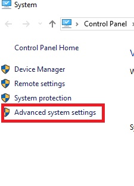 

- Go to "Advanced System Settings"  

    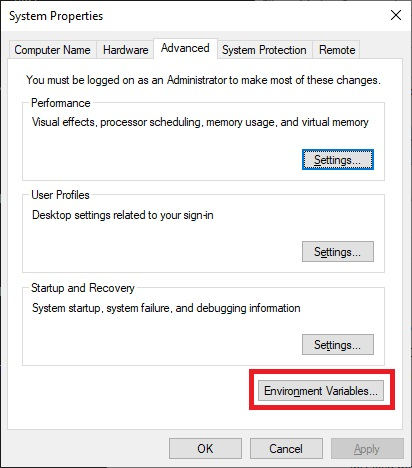  

- Add a new environment variable called `IDF_PATH` pointing to esp-idf repository folder on your pc 

    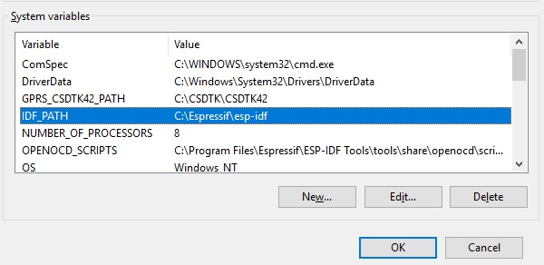  

- go to `Path` variable and click Edit  

    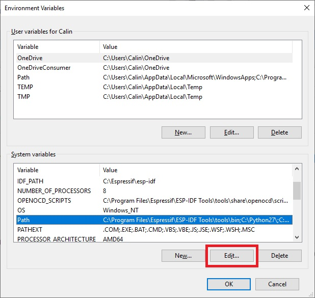  

- Add a new value: `%IDF_PATH%\tools`   

    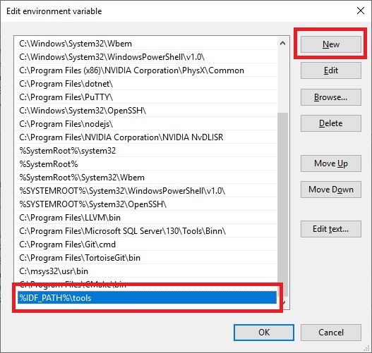   

4. Install https://dl.espressif.com/dl/esp-idf-tools-setup-1.2.exe 
to get the cmake, ninja build, openocd and all other tools needed to build, flash and debug the esp32 

## Set the drivers ##
1. Connect the Wrover Kit (or some other ft2232 debugger) o PC USB
2. Install the FTDI drivers from https://www.ftdichip.com/Drivers/VCP.htm

 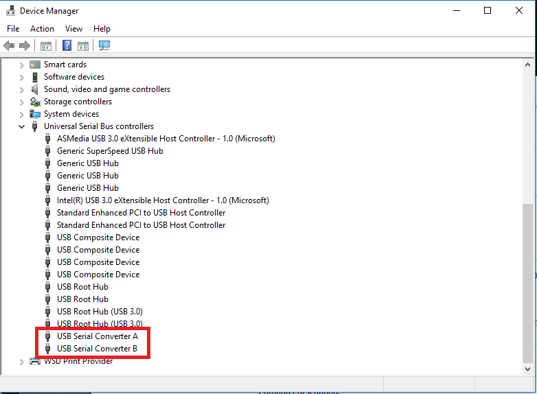

3. Download Zadig tool from https://zadig.akeo.ie/
4. Open Zadig Tool and go to Options->List All Devices

 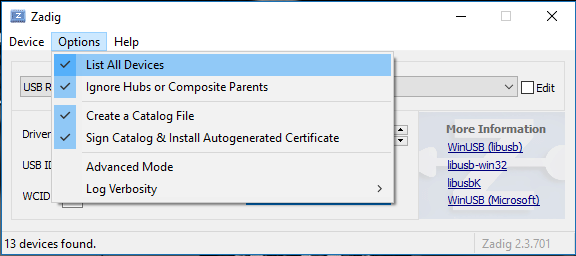

5. Select the FT2232 channel you want to use as Jtag.
In case of Wrover-Kit, is channel 0: “Dual RS232-HS (interface 0)”, according to Wrover-Kit schematic:

 

6. Select WinUSB -> Click Replace Driver  

 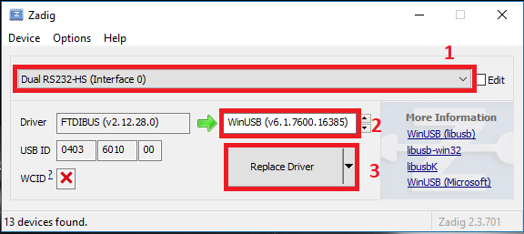

7. After operation completed, disconnect and reconnect the device to USB port
8. In case that other channel (channel 1 in case of wrover-kit) is not detected as com port (used by esptool for flashing),
you must enable the VCP mode on channel 1, this way:
- On device manager, right click on “USB Serial Converter B” - >Properties ->Advanced
Select “Load VCP” then click OK.

 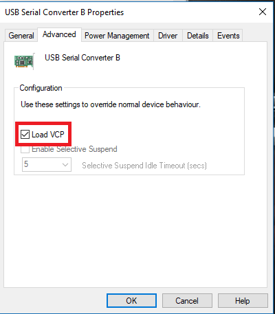

## Open the project, build, debug ##
## Get the IDE ##
1. Install Visual Studio code from https://code.visualstudio.com/docs/?dv=win

2. Open this project in VsCode: Right click on the project folder->Open with Code

 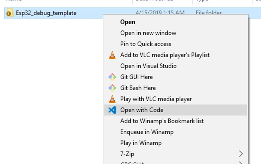

3. Open project Workspace

 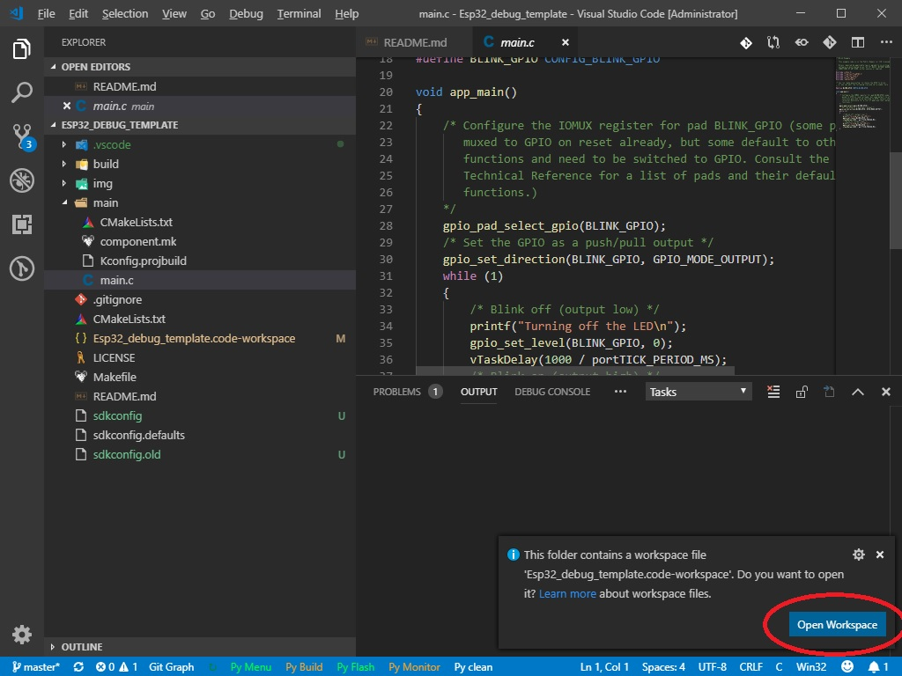

4. Install required extensions Allow VsCode to install the required extensions

 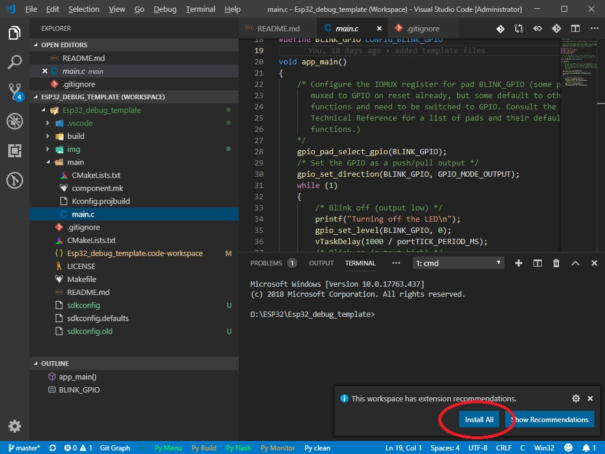

5. Once the VsCode extensions are installed properly, you should see the command buttons on the lower bar:

 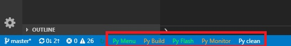

- `Py Menu` : Run Menuconfig  
    Will open menuconfig on VsCode console window.
    Note:   Allow VSCode to use cmd.exe when asked. 
            After this permision is granted, the menuconfig and build output will be shown on VsCode console window. 
            Resize the VsCode console window to fit the menuconfig, otherwise the menuconfig will complain...  

 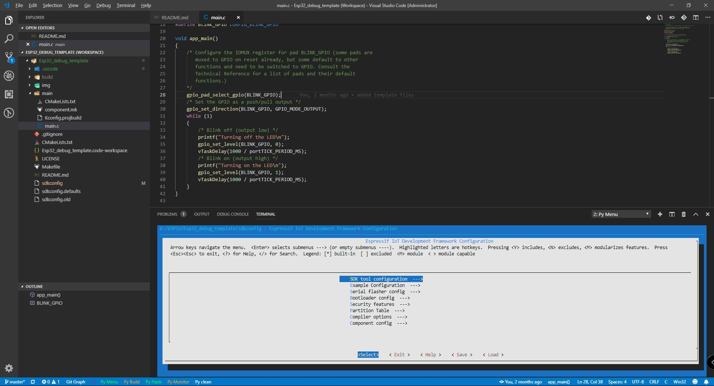

- `Py Build` : Build the project using Cmake and ninja build (faster than "make")  
    Note: Allow VSCode to use cmd.exe when asked to get the output on VsCode console.  
- `Py Flash` : Flash the compiled file to target board.  
    Note: Flasher will open the first disponible com port for flashing.  
    If you have more than 1 com port on device manager, make sure the ESP32 download port has the lowest com number.  
- `Py Monitor` : Open serial monitor.  
    Note: Use CTRL+C to close the monitor  
- `Py Clean` : Clean the project.  

6. To debug the project, follow this steps to start the debugger:   

 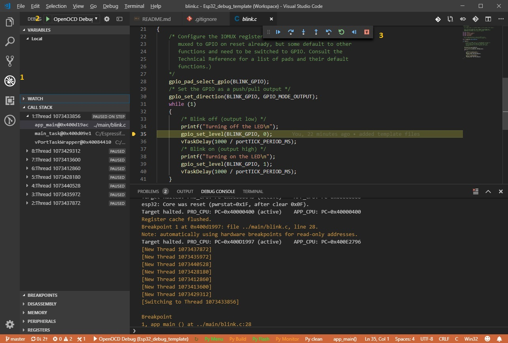

 ##Happy Debugging